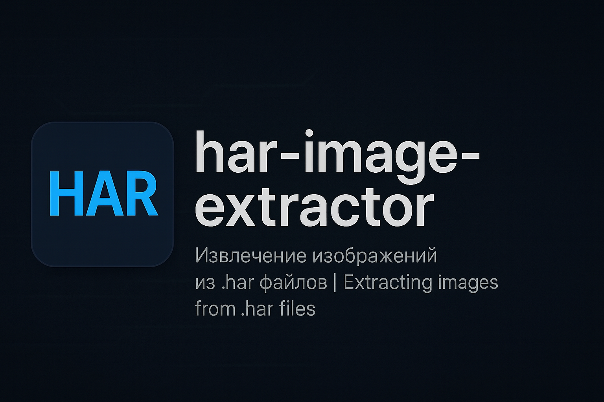

# IHAR — HAR Image Extractor

> A small tool to extract embedded images from `.har` files exported via browser DevTools.  
> Simple. Open-source. Made with ChatGPT-4o.

## 📌 What it does

IHAR extracts images directly embedded (as base64) inside `.har` files — useful for preserving media when access to source links is lost or blocked.

You can:
- Select a `.har` file exported from Chrome/Firefox/Edge
- Extract all images (PNG, JPEG, WEBP, AVIF...)
- Save them into a folder of your choice

## ⚙ How to use

### ✅ Recommended: Windows `.exe` version
1. Download and run `extractor_gui.exe`
2. Select HAR file (exported from browser)
3. (Optional) Select output folder
4. Click `IMPORT`
5. Images will appear in that folder

Works without Python. No installation needed.

### 🐍 Alternative: Run from source
- `pip install haralyzer pillow`
- `python extractor_gui.py`

## 🤖 Why this was created

> "This is not an attempt to pose as a developer, but a way to share a simple, working tool."

The author is passionate about IT, neural networks, and programming in general.  
This project was made openly using **ChatGPT-4o**, and the creator doesn't hide or deny that.

## 📖 License & Attribution

> 📝 This project is licensed under the **GNU GPLv3**.  
> You are free to use, modify, and redistribute this software, but you **must**:
> 
> - 🔒 Keep the original license (GPLv3)
> - 🙋 Mention the original author (2025)
> - 📂 Provide source code if you distribute a modified version
> 
> ---
> 💡 This tool was created openly using **ChatGPT-4o** (OpenAI) as a **code generation assistant**,  
> not as a co-author.  
>  
> 🧑 Author:Егорин Евгений Александрович  
🌍 Автор (EN): Egorin Eugene Alexandrovich  
🔗 GitHub: [wonderMoronWins](https://github.com/wonderMoronWins)  
📅 Год: 2025
---

## 📘 Overview as a generation tool, not as a co-author.
 of ChatGPT-4o (OpenAI)

# IHAR — Извлечение изображений из HAR

> Простая утилита для извлечения изображений из файлов `.har`, экспортированных из браузеров.

## 📌 What the program does / Что делает программа

**EN:**
  
IHAR extracts images encoded in base64 and embedded in `.har` files. This is useful when:
- The original page is no longer accessible
- The source requires login/authentication
- You want to grab images from dynamic content

**RU:**

IHAR извлекает изображения, закодированные в base64 и встроенные в `.har`-файлы. Это полезно, если:
- Страница больше недоступна
- Источник защищён / требует авторизации
- Нужно достать картинки с сайта, где всё динамически

## ⚙ How to use / Как пользоваться

**EN:**
  
### 🟢 If you use the `.exe` version:
1. Run `extractor_gui.exe`
2. Choose HAR file (Ctrl+Shift+I → Network → Save all as HAR)
3. Select output folder
4. Click `IMPORT`
5. Done — images appear in selected directory

### 🐍 If you run from source:
- `pip install haralyzer pillow`
- `python extractor_gui.py`

**RU:**

### 🟢 Если у вас `.exe`:
1. Запустите `extractor_gui.exe`
2. Выберите HAR-файл (через Ctrl+Shift+I → Network → Save all as HAR)
3. Укажите папку для сохранения
4. Нажмите `IMPORT`
5. Готово — файлы появятся в указанной директории

### 🐍 Если запускаете из кода:
- `pip install haralyzer pillow`
- `python extractor_gui.py`

## 💡 Почему это сделано

Автор не пытается выдать себя за программиста. Он хочет сделать доступным понятный, работающий инструмент.  
Проект создан с помощью **ChatGPT-4o**, и это открыто указывается.  
Интерес — в IT, нейросетях, автоматизации и простых решениях для повседневных задач.

## 📖 Лицензия и открытость

Проект распространяется по лицензии **GNU GPLv3**. Это означает:

- Исходный код открыт — вы можете изменять, распространять и собирать под себя
- **Обязательное условие**: сохранять указание автора и лицензии GPLv3
- При переработке проекта необходимо предоставить исходный код
- Программа разработана с помощью ChatGPT-4o (OpenAI) как инструмента генерации, а не соавтора

---

## ℹ️ Author

This project was created by Egorin Eugene Alexandrovich (2025)  
Developed with help of ChatGPT-4o (OpenAI) as a generation assistant.
